# My GitHub Metrics

| Overview | Follow up Issues & PRs |
|:--------:|:-------------------------:|
|  |  |
| Leetcode Stats | Notable Contributions |
|  |  |
| Achievements | Language Activity |
|  |  |
| Discussions | Reactions |
|  |  |

